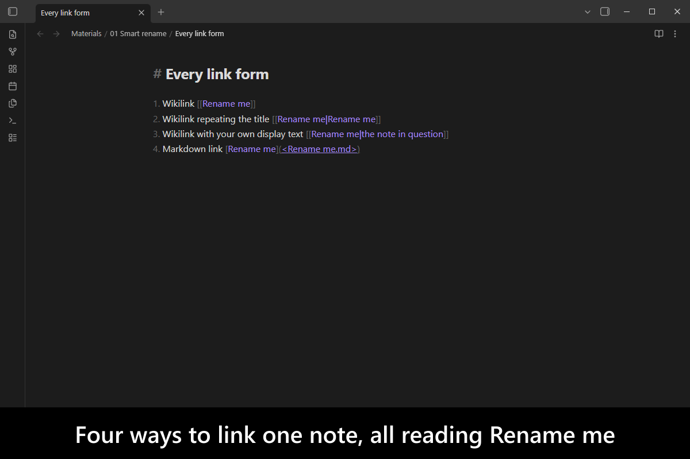
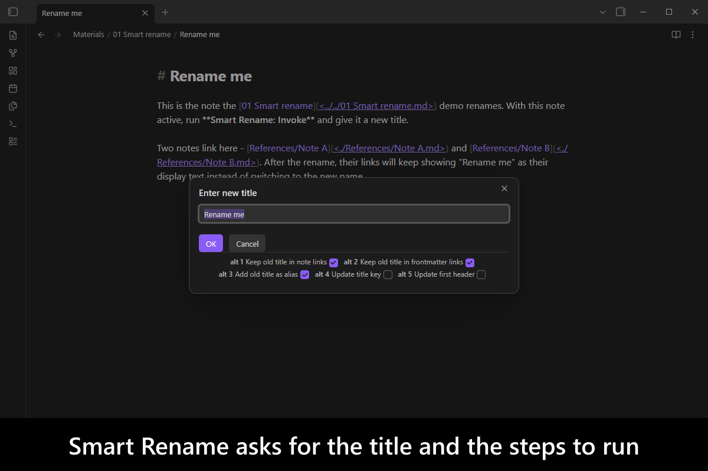
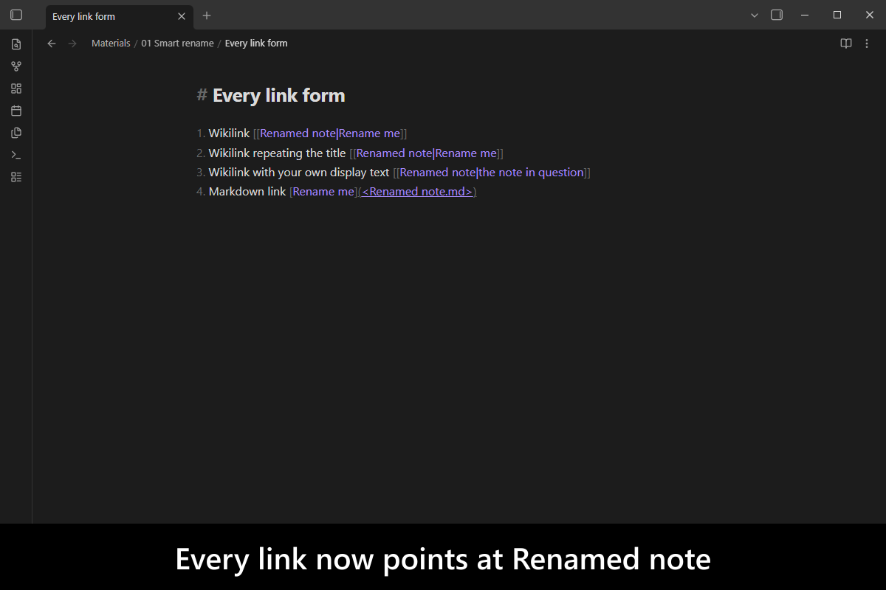
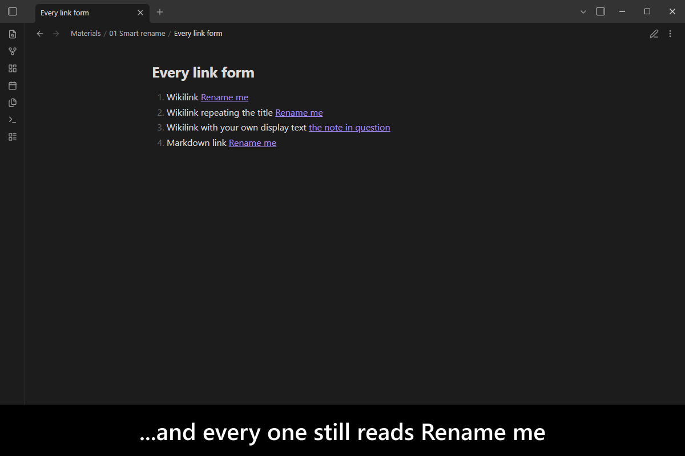
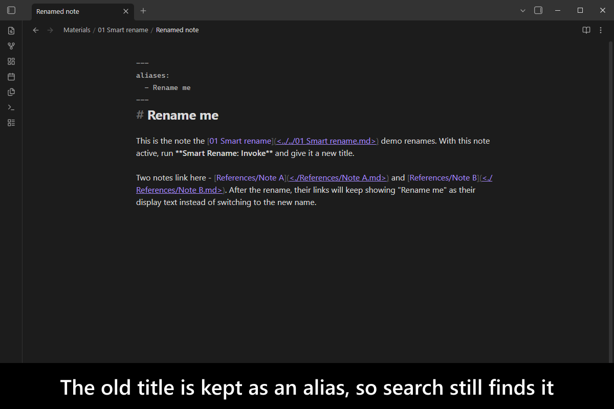
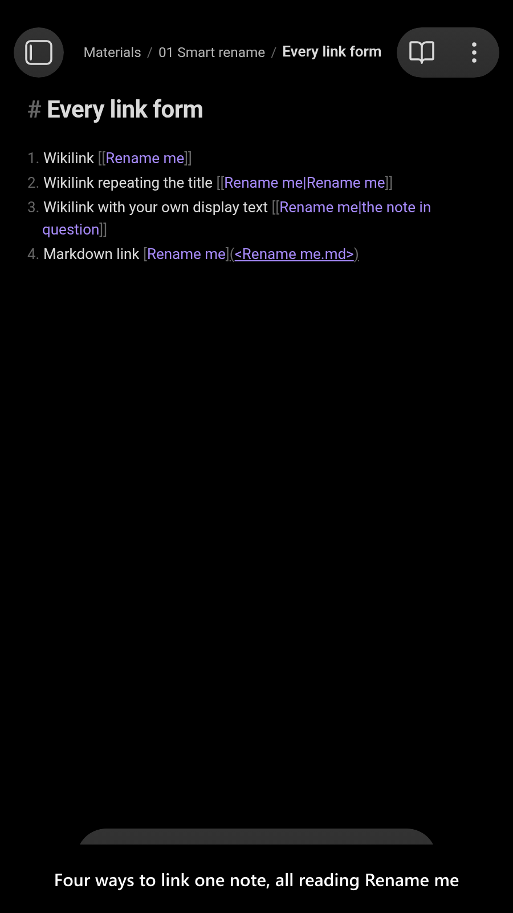
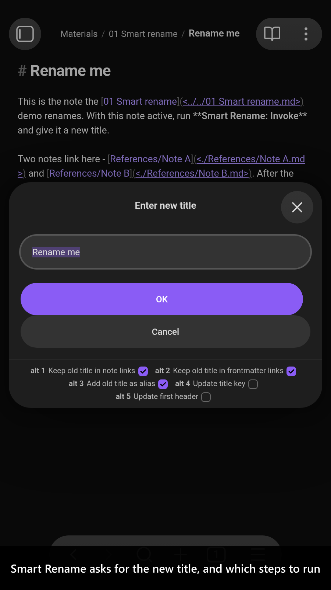
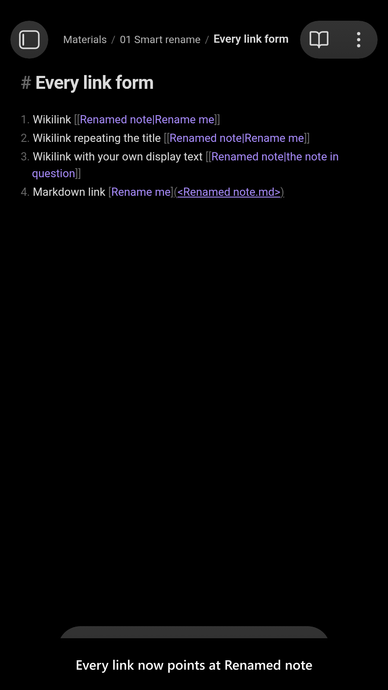
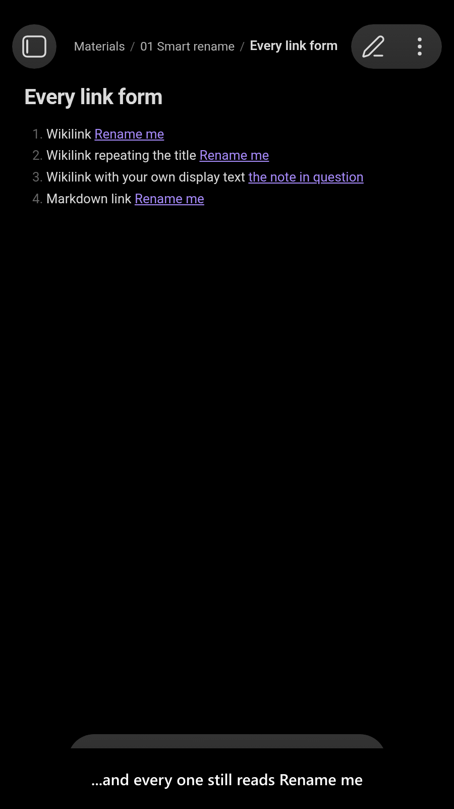
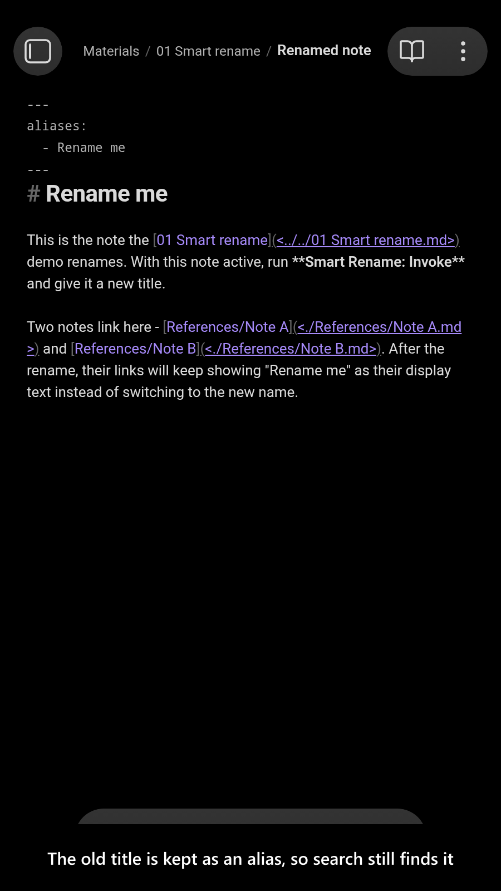

# Smart Rename

[](https://www.buymeacoffee.com/mnaoumov) [](https://github.com/mnaoumov/obsidian-smart-rename/releases) [](https://github.com/mnaoumov/obsidian-smart-rename/releases) [](https://github.com/mnaoumov/obsidian-smart-rename)

Rename a note in [Obsidian](https://obsidian.md/) and every link to it is rewritten — including the words your reader sees. A sentence that read "as covered in `[[Project brief]]`" silently becomes "as covered in `[[2026 Q3 plan]]`", and prose you wrote carefully now says something you did not write.

This plugin renames the note and keeps the old title as the link's **display text**, so `[[Old title]]` becomes `[[New title|Old title]]` and your sentences still read the way you wrote them. The old title is also kept as an alias, so anything still looking for it finds it.

<!-- markdownlint-disable MD033 -->

<a href="https://github.com/mnaoumov/obsidian-smart-rename/blob/HEAD/images/screenshots/screenshot-desktop-1.png"></a>

<details>
<summary>More screenshots</summary>

<div>
<a href="https://github.com/mnaoumov/obsidian-smart-rename/blob/HEAD/images/screenshots/screenshot-desktop-2.png"></a>
<a href="https://github.com/mnaoumov/obsidian-smart-rename/blob/HEAD/images/screenshots/screenshot-desktop-3.png"></a>
<a href="https://github.com/mnaoumov/obsidian-smart-rename/blob/HEAD/images/screenshots/screenshot-desktop-4.png"></a>
<a href="https://github.com/mnaoumov/obsidian-smart-rename/blob/HEAD/images/screenshots/screenshot-desktop-5.png"></a>
<a href="https://github.com/mnaoumov/obsidian-smart-rename/blob/HEAD/images/screenshots/screenshot-mobile-1.png"></a>
<a href="https://github.com/mnaoumov/obsidian-smart-rename/blob/HEAD/images/screenshots/screenshot-mobile-2.png"></a>
<a href="https://github.com/mnaoumov/obsidian-smart-rename/blob/HEAD/images/screenshots/screenshot-mobile-3.png"></a>
<a href="https://github.com/mnaoumov/obsidian-smart-rename/blob/HEAD/images/screenshots/screenshot-mobile-4.png"></a>
<a href="https://github.com/mnaoumov/obsidian-smart-rename/blob/HEAD/images/screenshots/screenshot-mobile-5.png"></a>
</div>

</details>

<!-- markdownlint-enable MD033 -->

## Demo vault

**The documentation is a demo vault.** Every feature has a note that explains what it does and why you would want it, with a note ready to rename and backlinks ready to watch.

**[Start reading here](<./demo-vault/00 Start.md>)** — it is plain markdown, so it works on GitHub with nothing installed.

A copy of the vault ships with every release. You can access it via any of the following:

1. Running the **Smart Rename: Open demo vault** command.
2. Downloading `smart-rename-demo-vault.zip` from the [Releases](https://github.com/mnaoumov/obsidian-smart-rename/releases). It unzips into a single `smart-rename-demo-vault-<version>` folder.
3. Browsing its source in [`demo-vault/`](./demo-vault/README.md) in this repository.

## What it does

- **Backlinks keep their old display text.** `[[Old title]]` becomes `[[New title|Old title]]`, and a link that already had display text you chose is left alone — a plain rename was always right for those. Every link form, before and after, is worked through in the vault. [01 Smart rename](<./demo-vault/01 Smart rename.md>)
- **The old title becomes an alias**, so searches and links using it still resolve — unless you untick it for that one rename. [01 Smart rename](<./demo-vault/01 Smart rename.md>)
- **Every step is a checkbox in the rename prompt**, pre-ticked from your settings, so a single rename can skip the alias, the header or the link rewrites without a trip to Settings. [01 Smart rename](<./demo-vault/01 Smart rename.md>)
- **Invalid characters are handled**, rather than the rename being refused, when the title you want cannot be a file name. [02 Invalid characters](<./demo-vault/02 Invalid characters.md>)
- **A linked note can be renamed from where you link to it.** Put the cursor on a link, run the command, and the note that link points at is smart-renamed — you never open it. Works on wikilinks, markdown links, embeds and frontmatter links alike. [03 Rename the link target](<./demo-vault/03 Rename the link target.md>)
- **The first header and a frontmatter title key** can be kept in sync with the new name. [04 Settings](<./demo-vault/04 Settings.md>)

## Installation

The plugin is available in [the official Community Plugins repository](https://community.obsidian.md/plugins/smart-rename).

### Beta versions

To install the latest beta release of this plugin (regardless if it is available in [the official Community Plugins repository](https://community.obsidian.md) or not), follow these steps:

1. Ensure you have the [BRAT plugin](https://community.obsidian.md/plugins/obsidian42-brat) installed and enabled.
2. Click [Install via BRAT](https://intradeus.github.io/http-protocol-redirector?r=obsidian://brat?plugin=https://github.com/mnaoumov/obsidian-smart-rename).
3. An Obsidian pop-up window should appear. In the window, click the `Add plugin` button once and wait a few seconds for the plugin to install.

## Debugging

By default, debug messages for this plugin are hidden.

To show them, run the following command:

```js
window.DEBUG.enable('smart-rename');
```

For more details, refer to the [documentation](https://mnaoumov.dev/obsidian-dev-utils/guides/debugging/).

## Changelog

All notable changes to this project will be documented in the [CHANGELOG](./CHANGELOG.md).

## Contributing

Contributions are welcome — see [CONTRIBUTING](./CONTRIBUTING.md) to get set up.

## Support

<!-- markdownlint-disable MD033 -->

<a href="https://www.buymeacoffee.com/mnaoumov" target="_blank"></a>

<!-- markdownlint-enable MD033 -->

## My other Obsidian resources

[See my other Obsidian resources](https://github.com/mnaoumov/obsidian-resources).

## License

© [Michael Naumov](https://github.com/mnaoumov/)
